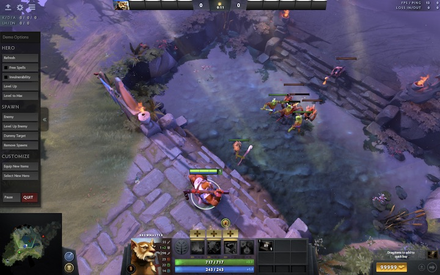
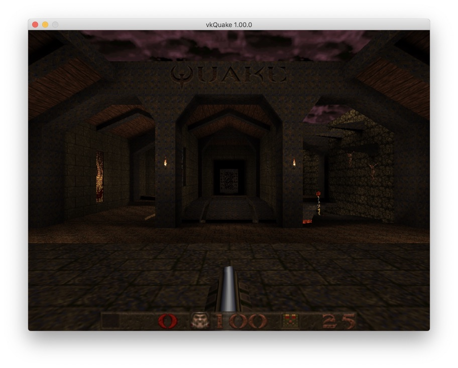
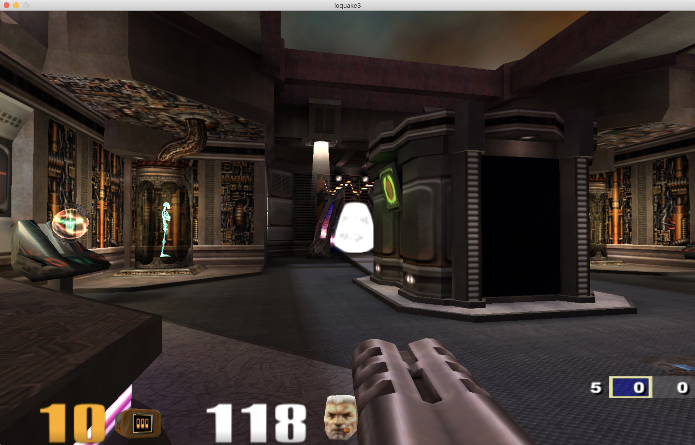
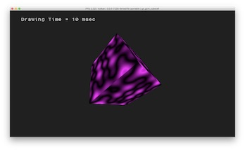
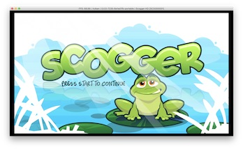
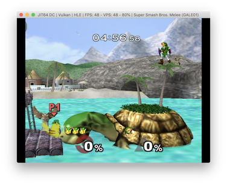
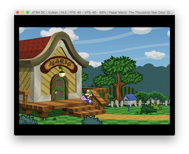
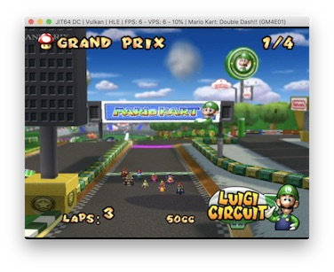
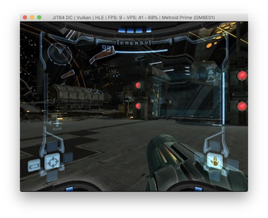

## gfx-portability
[](https://travis-ci.org/gfx-rs/portability)
[](https://gitter.im/gfx-rs/portability)

This is a prototype library implementing [Vulkan Portability Initiative](https://www.khronos.org/blog/khronos-announces-the-vulkan-portability-initiative) using [gfx-hal](http://gfx-rs.github.io/2017/07/24/low-level.html). See gfx-rs [meta issue](https://github.com/gfx-rs/gfx/issues/1354) for backend limitations and further details.

## Showcase

### [Dota2](https://github.com/ValveSoftware/Dota-2):


### Quake
- [vkQuake](https://github.com/Novum/vkQuake)
- [vkQuake2](https://github.com/kondrak/vkQuake2)
- [vkQuake3](https://github.com/suijingfeng/vkQuake3)

 

### [RPCS3](https://github.com/RPCS3/rpcs3):

 

### [Dolphin](https://github.com/dolphin-emu):
 
 

## Instructions

Despite the fact it's written in Rust, the produced binaries have standard lining interface compatible with any program (written in the language of your choice). There are multiple ways to link to gfx-portability.

### Dynamic linking

Typically, you'd need to create a symbolic link with a name that a target application expects, e.g. `libvulkan.dylib -> libportability.dylib`.

Check out and build:
```
git clone --recursive https://github.com/gfx-rs/portability && cd portability
cargo build --manifest-path libportability/Cargo.toml --features <vulkan|dx12|metal>
```

### ICD provider

gfx-portability can be used with Vulkan loader like any other Vulkan driver. In order to use it this way, you need to build `libportability-icd` and point to it from an ICD json file:
```
VK_ICD_FILENAMES=portability/libportability-icd/portability-macos-debug.json <some_vulkan_app>
```

### Static linking

For C, you'd need to add `crate-type = ["cdylib"]` to `libportability-gfx/Cargo.toml` and build it with the backend of your choice. Note: features of this library are fully-qualified crate names, e.g. `features gfx-backend-metal`. For rust, just point the cargo dependency to `libportability-gfx`.

## Running Samples

### LunarG (API-Samples)
After building `portability` as shown above, grab a copy from https://github.com/LunarG/VulkanSamples.
Manually override the [`VULKAN_LOADER`](https://github.com/LunarG/VulkanSamples/blob/master/API-Samples/CMakeLists.txt#L189-L194) variable and set it to the portability library.
```
set (VULKAN_LOADER "path/to/portability/library")
```
Then proceed with the normal build instructions.

## Vulkan CTS coverage

Please visit [our wiki](https://github.com/gfx-rs/portability/wiki/Vulkan-CTS-status) for CTS hookup instructions. Once everything is set, you can generate the new results by calling `make cts` on Unix systems. When investigating a particular failure, it's handy to do `make cts debug=<test_name>`, which runs a single test under system debugger (gdb/lldb). For simply inspecting the log output, one can also do `make cts pick=<test_name>`.
